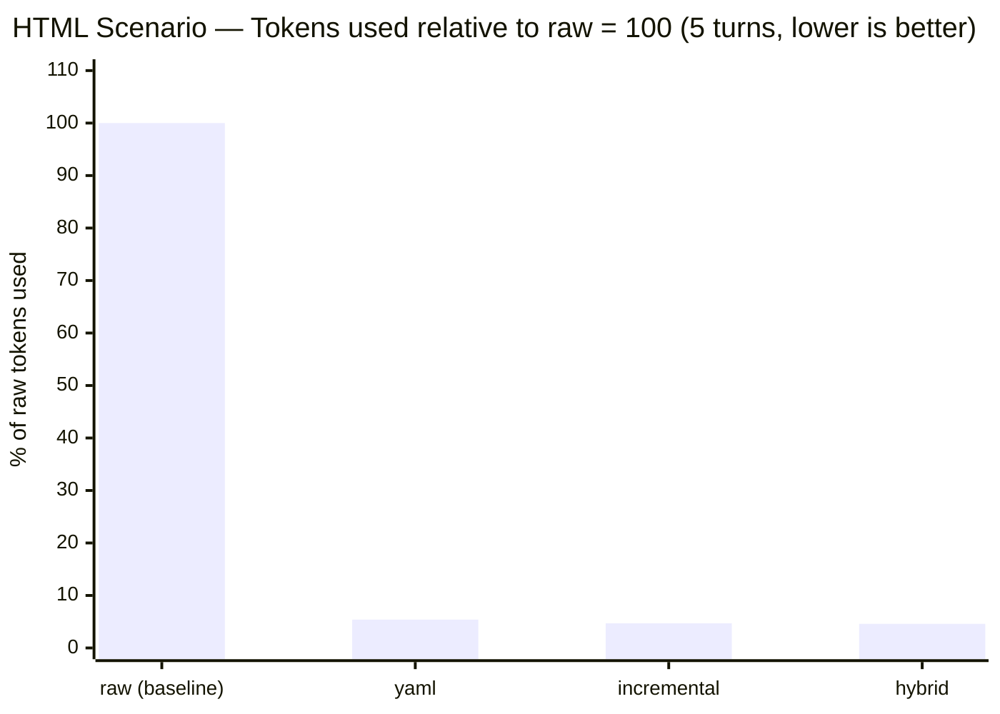
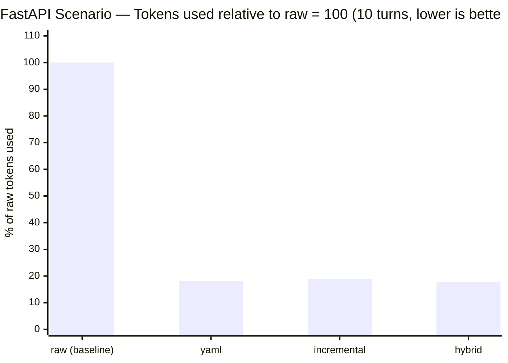
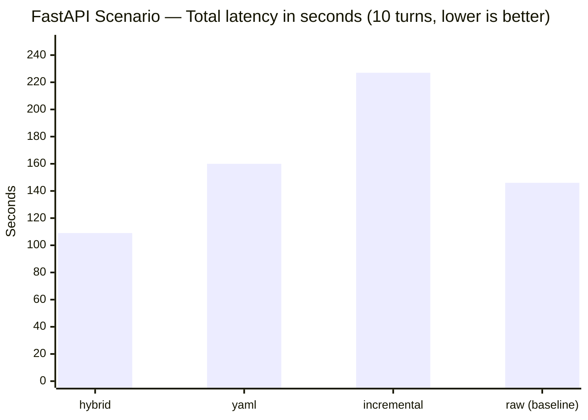
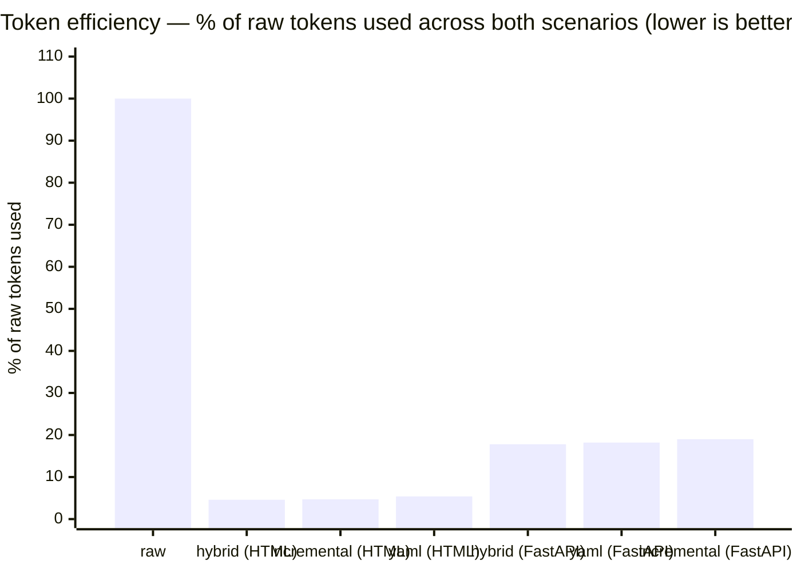

# ShapeShifter

**A local OpenAI-compatible proxy that compresses conversation history before sending it to any LLM provider — cutting input tokens by up to 97% while preserving output quality.**


Human language is powerful, but it's not efficient in an LLM context. This context continues to grow, as do scenarios involving coding agents and agent swarms.

ShapeShifter reshapes the context to make it more efficient, smaller, concentrated, and distilled.

It is a structural reformulation of the context using more efficient archetypes and methodologies, eliminating duplications, cleaning up redundant information.

ShapeShifter sits between your AI client (Cline, Continue, Open WebUI, curl, your own code) and any OpenAI-compatible upstream API. It restructures the conversation context using one of nine configurable transformer modes and forwards a leaner payload to the model. Your client sees a standard OpenAI API — no changes required on either side.

```
Your client  →  ShapeShifter :8787  →  OpenRouter / DeepSeek / OpenAI / Ollama / …
               (compresses history)       (receives only what matters)
```

---

## Why it exists

LLM pricing is based on input tokens. In multi-turn conversations, the context window fills up with previous exchanges — most of which the model doesn't need to answer the current question. ShapeShifter restructures that history into a compact representation, sending the model only the signal without the noise.

Key properties:
- **Drop-in**: standard OpenAI `/v1/chat/completions` endpoint, no client modifications
- **Provider-agnostic**: works with any OpenAI-compatible upstream (see [Supported Platforms](#supported-platforms))
- **Nine transformer modes**: from raw passthrough to aggressive symbolic compression
- **Live dashboard**: real-time token savings, per-mode stats, request feed, context viewer
- **Coding-session aware**: `hybrid`, `yaml`, and `incremental` modes detect multi-turn coding sessions and preserve all user requirements while discarding generated code from history
- **Multi-turn benchmark suite**: reusable JSON scenarios for measuring compression vs. output quality across modes

---

## Supported Platforms

### Upstream LLM providers (where ShapeShifter forwards requests)

| Provider | Base URL | Notes |
|---|---|---|
| **OpenRouter** | `https://openrouter.ai/api/v1` | Access to 200+ models |
| **DeepSeek** | `https://api.deepseek.com/v1` | DeepSeek-V3, R1 |
| **OpenAI** | `https://api.openai.com/v1` | GPT-4o, o1, o3 |
| **Anthropic (via proxy)** | any compatible endpoint | e.g. via LiteLLM |
| **Groq** | `https://api.groq.com/openai/v1` | Fast inference |
| **Together AI** | `https://api.together.xyz/v1` | Open-source models |
| **Ollama** | `http://localhost:11434/v1` | Local models, no API key needed |
| **LM Studio** | `http://localhost:1234/v1` | Local models |
| Any OpenAI-compatible | custom URL | If it speaks `/v1/chat/completions`, it works |

### AI clients (that connect to ShapeShifter)

| Client | How to configure |
|---|---|
| **Cline** (VS Code) | API Provider: OpenAI Compatible · Base URL: `http://localhost:8787/v1` |
| **Continue** (VS Code / JetBrains) | OpenAI provider · Base URL: `http://localhost:8787/v1` |
| **Open WebUI** | Settings → Connections → OpenAI API → `http://localhost:8787/v1` |
| **Msty** | Add provider → OpenAI Compatible → `http://localhost:8787/v1` |
| **LM Studio** | Remote server → custom endpoint → `http://localhost:8787/v1` |
| **curl / httpx / OpenAI SDK** | Set `base_url="http://localhost:8787/v1"` |
| Any OpenAI-compatible client | Point to `http://localhost:8787/v1` |

> **Web UIs** (chat.openai.com, chat.deepseek.com) use proprietary session-based protocols and cannot be proxied by ShapeShifter. Use an API client or a self-hosted UI like Open WebUI instead.

---

## Installation

**Requirements:** Python 3.10+

```bash
git clone https://github.com/gincarbone/shapeshifter.git
cd shapeshifter
```

The start scripts handle everything automatically (virtual environment creation, dependency installation, `.env` setup). Just run the one that matches your platform — no manual setup needed.

| Platform | Command |
|---|---|
| Windows (cmd) | `start.bat` |
| Windows (PowerShell) | `.\start.ps1` |
| macOS / Linux | `bash start.sh` |

On first run the script creates a local `.venv`, installs all dependencies, and copies `.env.example` to `.env`. On subsequent runs it only reinstalls if `requirements.txt` has changed.

<details>
<summary>Manual setup (optional)</summary>

```bash
python -m venv .venv

# Windows
.venv\Scripts\activate
# macOS / Linux
source .venv/bin/activate

pip install -r requirements.txt
cp .env.example .env   # then edit .env
python wrapper_server.py
```

</details>

**Dependencies:** `fastapi`, `uvicorn`, `httpx`, `python-dotenv`, `tiktoken`, `pyyaml`

---

## Configuration

Copy `.env.example` to `.env` and fill in your values:

```env
# Server
WRAPPER_HOST=127.0.0.1
WRAPPER_PORT=8787

# Upstream provider — any OpenAI-compatible URL
UPSTREAM_BASE_URL=https://openrouter.ai/api/v1
UPSTREAM_API_KEY=your-api-key-here
DEFAULT_MODEL=deepseek/deepseek-v4-flash

# Context compression
CONTEXT_MODE=hybrid        # hybrid | yaml | incremental | raw | minimal | yaml | json | table | symbolic | matrix
AUTO_MODE=false            # true = auto-select mode per request

# Logging
LOG_REQUESTS=true
LOG_RESPONSES=true
LOG_DIR=logs
```

### Context modes

| Mode | Strategy | Best for |
|---|---|---|
| `hybrid` | Extracts user requirements as structured list, drops generated code from history | Multi-turn coding sessions |
| `yaml` | Cumulative requirements as YAML, drops assistant responses | Multi-turn coding sessions |
| `incremental` | Explicit numbered requirement list, verbatim user messages | Multi-turn coding sessions |
| `raw` | No compression (passthrough) | Baseline / debugging |
| `minimal` | First user intent + error lines only | Simple Q&A, debug requests |
| `json` | Structured JSON context packet | API integrations |
| `table` | Markdown table summary | Comparison tasks |
| `symbolic` | Symbolic logic notation | Dense technical context |
| `matrix` | Entity matrix format | Multi-file analysis |

The mode can be overridden per-request via:
- HTTP header: `X-Context-Mode: yaml`
- Request body field: `"context_mode": "yaml"`

---

## First Run

Edit `.env` to set `UPSTREAM_API_KEY` and `UPSTREAM_BASE_URL`, then launch the start script for your platform:

```
# Windows (cmd)
start.bat

# Windows (PowerShell)
.\start.ps1

# macOS / Linux
bash start.sh
```

```
  ShapeShifter v0.2  —  http://127.0.0.1:8787/v1
  Dashboard        —  http://127.0.0.1:8787/dashboard
  Mode: hybrid | Auto: False | Upstream: https://openrouter.ai/api/v1
```

Open the dashboard at **http://127.0.0.1:8787/dashboard** to monitor live token savings.

Point your AI client to **http://127.0.0.1:8787/v1** instead of the upstream provider.

### Quick test

```bash
curl http://127.0.0.1:8787/health
# {"status":"ok","version":"0.2.0","uptime_s":3}

curl http://127.0.0.1:8787/v1/chat/completions \
  -H "Content-Type: application/json" \
  -d '{"model":"deepseek/deepseek-v4-flash","messages":[{"role":"user","content":"Hello"}]}'
```

---

## Usage

### Dashboard

The live dashboard at `/dashboard` shows:

- **Token savings** in real time (total, per request, per mode)
- **Request feed** with mode used, model, tokens before/after, reduction %, latency
- **Context viewer**: click "view" on any request to see the original context and the restructured version side by side
- **Model switcher**: change the active model on the fly without restarting

### Changing model at runtime

```bash
curl -X POST http://127.0.0.1:8787/v1/config/model \
  -H "Content-Type: application/json" \
  -d '{"model": "openai/gpt-4o-mini"}'
```

### Inspecting a restructured context

```bash
curl http://127.0.0.1:8787/v1/requests/{request_id}/context
# Returns {"raw": "...", "transformed": "..."}
```

### Stats API

```bash
curl http://127.0.0.1:8787/v1/stats/summary
curl http://127.0.0.1:8787/v1/stats/recent
```

Every API response includes an inline `_shapeshifter` field with per-request metrics:

```json
"_shapeshifter": {
  "request_id": "req_a3f1c2b4",
  "mode": "hybrid",
  "tokens_before": 8420,
  "tokens_after": 312,
  "tokens_saved": 8108,
  "compression_ratio": 0.037,
  "reduction_pct": 96.3,
  "latency_ms": 1842.0
}
```

---

## Benchmark Suite

ShapeShifter includes a multi-turn coding benchmark that measures compression efficiency vs. output quality across all modes.

```bash
# Run all modes — generates HTML report with per-mode output previews
python benchmark_coding.py --scenario benchmarks/scenarios/html_landing_page.json --max-tokens 12000

# Specific modes only
python benchmark_coding.py --scenario benchmarks/scenarios/html_landing_page.json --modes "hybrid,yaml,incremental"

# Compression metrics only, no API calls
python benchmark_coding.py --scenario benchmarks/scenarios/html_landing_page.json --local-only
```

Scenarios are JSON files in `benchmarks/scenarios/`. Each defines a multi-turn conversation, automated functionality checks, and the artifact type to extract from the final response.

---

## Benchmark Results

All benchmarks use `deepseek/deepseek-v4-flash` via OpenRouter. Each scenario runs all modes **in parallel** — total wall-clock time equals one mode's sequential run time, not the sum.

---

### Scenario 1 — HTML Landing Page (5 turns)

A 5-turn session building a complex single-file HTML page: sticky navbar, animated hero with CSS keyframes, IntersectionObserver counters, dark/light mode with `localStorage`, real-time form validation, pricing modal with card auto-format and payment spinner.

**10 automated checks** on the final HTML output.

| Mode | Tokens Saved | Reduction | Latency | Quality |
|---|---:|---:|---:|---:|
| `hybrid` | 46,524 | **95.4%** | 304s | **10 / 10** |
| `incremental` | 46,994 | 95.3% | 438s | **10 / 10** |
| `yaml` | 42,767 | 94.6% | 473s | **10 / 10** |
| `raw` *(baseline)* | 0 | 0% | 658s | 8 / 10 |



---

### Scenario 2 — FastAPI Server (10 turns)

A 10-turn session building a production FastAPI server from scratch to 8 endpoints: `/health`, `GET/POST/PUT/DELETE /items`, `/auth/login`, `/auth/me`, `/ws/{client_id}`. Progressive additions include Pydantic models, SQLAlchemy + SQLite persistence, JWT authentication, protected routes, slowapi rate limiting, WebSocket, structured logging, and a global error handler.

**10 automated checks** on the final Python output.

| Mode | Tokens Saved | Reduction | Latency | Quality |
|---|---:|---:|---:|---:|
| `hybrid` | 24,308 | **82.2%** | **109s** | **10 / 10** |
| `yaml` | 24,835 | 81.8% | 160s | **10 / 10** |
| `incremental` | 22,764 | 81.0% | 227s | **10 / 10** |
| `raw` *(baseline)* | 0 | 0% | 146s | 10 / 10 |





> **`hybrid` used only 17.8% of the tokens that `raw` would send — and finished 25% faster (109 s vs 146 s).** Less context means the model generates each response faster; the local compression step adds negligible overhead.



> *All bars show tokens sent to the upstream model as a percentage of what `raw` mode would send. A value of 5 means ShapeShifter sent 20× fewer tokens.*

---

### Key findings

- **All three ShapeShifter modes achieve 10/10 quality** across both scenarios while saving 81–95% of input tokens — equal or better than raw passthrough
- **`raw` is NOT the quality baseline**: in the HTML scenario it scored only 8/10 — accumulated generated code in the context window actively confused the model rather than helping it
- **Compression makes responses faster, not slower**: in the FastAPI scenario, `hybrid` completed all 10 turns in **109 s** vs **146 s** for `raw` — a 25% speed gain. Fewer input tokens means less time for the model to process context and less time to generate a completion. The local compression step adds microseconds, not seconds.
- **Token savings scale with conversation length**: ~95% reduction on 5-turn HTML, ~82% on 10-turn FastAPI. As sessions grow, more generated code accumulates — ShapeShifter removes all of it while keeping every user instruction intact.
- All three coding-session modes (`hybrid`, `yaml`, `incremental`) work the same way: **discard `[ASSISTANT]` responses from history** (generated code weighing thousands of tokens), **keep all `[USER]` messages verbatim** (requirements, pasted code, examples). The current user message is always forwarded intact and never compressed.
- **Language detection is universal**: Python, JavaScript, TypeScript, Rust, Go, Java, C/C++, C#, Ruby, PHP, Swift, Kotlin, SQL, HTML and any fenced code block are auto-detected — no configuration needed

### Important implementation note

ShapeShifter compresses only the **conversation history**, never the current user message. If you paste code in your message and ask a question, the code travels to the model untouched. Only previous assistant responses (generated code from earlier turns) are removed from context.

---

## Project Structure

```
shapeshifter/
├── wrapper_server.py        # FastAPI server — main entry point
├── transformers.py          # Nine context transformer modes
├── llm_client.py            # Upstream HTTP client
├── token_counter.py         # Token counting and compression stats
├── output_contracts.py      # System prompts per task type
├── mode_selector.py         # Auto mode selection heuristics
├── benchmark.py             # Single-turn compression benchmark
├── benchmark_coding.py      # Multi-turn coding quality benchmark
├── benchmarks/
│   └── scenarios/
│       ├── html_landing_page.json   # 5-turn HTML landing page scenario
│       └── fastapi_server.json      # 10-turn FastAPI server scenario
├── requirements.txt
└── .env                     # Configuration (not committed)
```

---

## Author

**ShapeShifter** was conceived and built by *Gaetano Marcello Incarbone**.

The core idea — structural reformulation of conversation context rather than lossy compression, with language-agnostic coding-session detection and per-provider key management — originated from his work on reducing LLM costs in multi-turn coding agent workflows.

If you build on ShapeShifter, attribution in your README or documentation is appreciated.

The idea is entirely human, as are the various attempts to conceptualize, synthesize, visualize, and rationalize the context. The code made heavy use of vibecoding (70% - 75%) and rework until the final result.
Shapeshifter is still in the testing phase. Please report any anomalies or usability issues. I apologize in advance for any problems.
---

## License

MIT License © 2026 Marcello Incarbone

Permission is hereby granted, free of charge, to any person obtaining a copy of this software to use, copy, modify, merge, publish, distribute, sublicense, and/or sell copies, subject to the condition that the above copyright notice and this permission notice are included in all copies or substantial portions of the Software.

See the [LICENSE](LICENSE) file for the full text.

