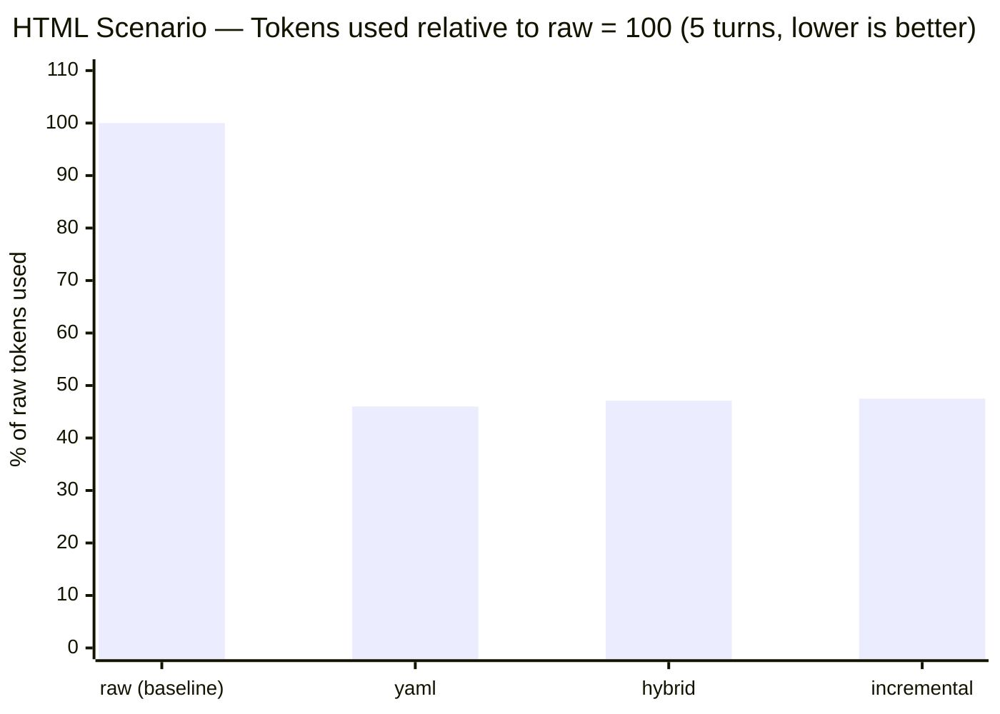
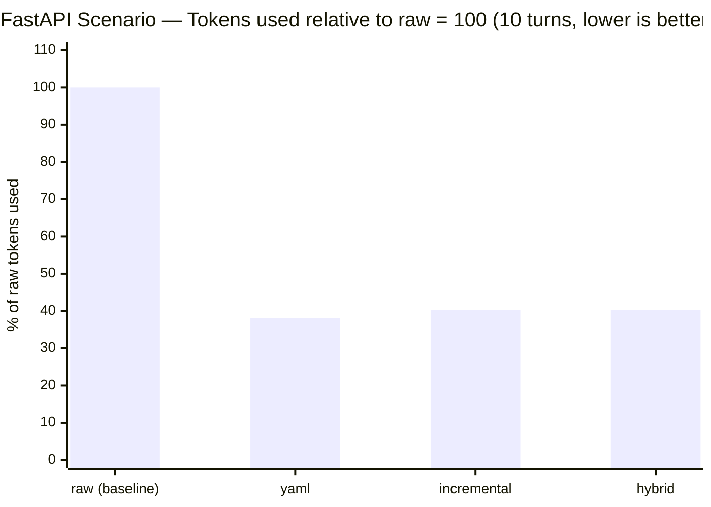
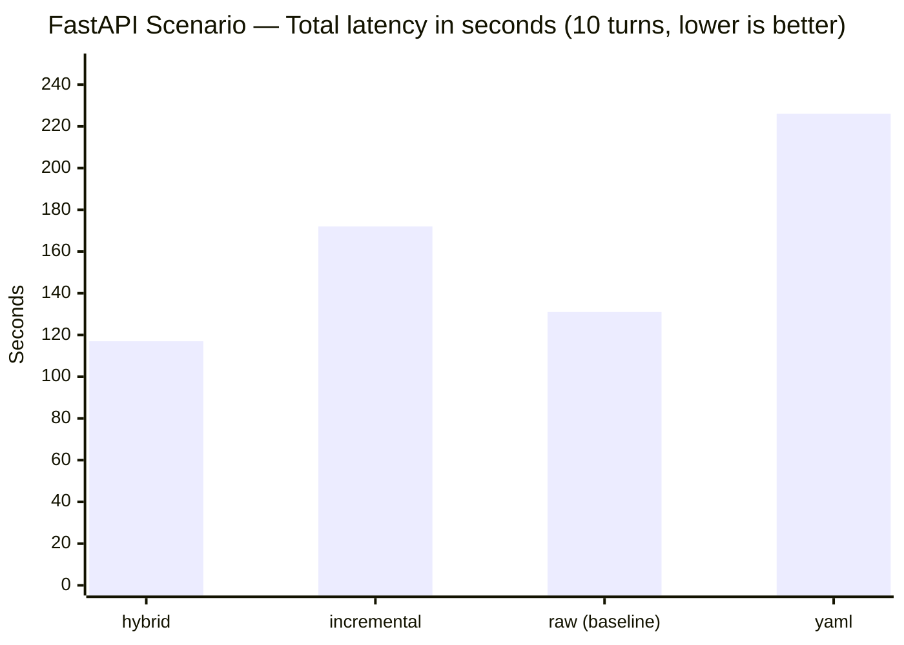
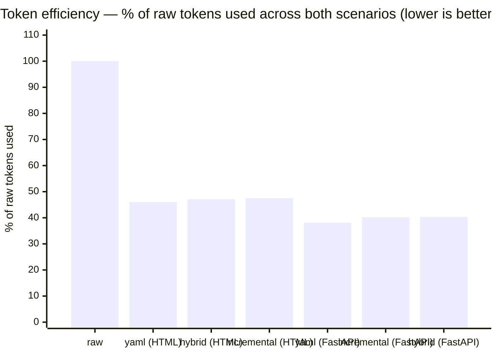

# ShapeShifter

[](https://github.com/gincarbone/shapeshifter/actions/workflows/tests.yml)

**A drop-in OpenAI proxy that cuts coding-agent input tokens by roughly half — by dropping every superseded version of code your session has already moved past, and nothing else.**

In a multi-turn coding session, most of your context window is old generated code — earlier drafts of files you've since revised. The model doesn't need turn 1's draft once turn 3 has superseded it, but it does need the *current* version to make a precise edit or fix a bug. ShapeShifter sits between your client (Cline, Continue, Aider, Open WebUI, curl, your own code) and any OpenAI-compatible API. It strips superseded drafts out of the history, keeps the **latest version of every file** plus every one of your instructions **verbatim**, and forwards a payload that's a fraction of the size. Standard API in, standard API out — nothing changes on either end.


> **How is this different from others LLM Compression Technologies like Headroom?** Others drops low-value *tokens* using an ML model — lossy and opaque. ShapeShifter is structural and predictable: it removes only *superseded* assistant-generated code blocks from history — keeping the current file intact — and never touches your messages. No extra model, no lossy token soup, no config.


**In the benchmarks below, all three coding modes score 9–10/10 on the same automated checks as uncompressed `raw` — while sending 38–57% of the tokens, depending on how much of the session is fresh generation vs. editing existing code.**

```
Your client  →  ShapeShifter (http://127.0.0.1:8787)  →  OpenRouter / DeepSeek / OpenAI / Ollama / …
               (compresses history)       (receives only what matters)
```

---

## Why it exists

LLM pricing is based on input tokens. In multi-turn conversations, the context window fills up with previous exchanges — most of which the model doesn't need to answer the current question. ShapeShifter restructures that history into a compact representation, sending the model only the signal without the noise.

Key properties:
- **Drop-in**: standard OpenAI `/v1/chat/completions` endpoint, no client modifications
- **Provider-agnostic**: works with any OpenAI-compatible upstream (see [Supported Platforms](#supported-platforms))
- **Nine transformer modes**: from raw passthrough to aggressive symbolic compression
- **Live dashboard**: real-time token savings, per-mode stats, request feed, context viewer
- **Coding-session aware**: `hybrid`, `yaml`, and `incremental` modes detect multi-turn coding sessions, preserve all user requirements, and keep the latest version of every generated file — only superseded versions are dropped from history, so edit/debug turns still see the code they're changing
- **Multi-turn benchmark suite**: reusable JSON scenarios for measuring compression vs. output quality across modes

---

## Supported Platforms

### Upstream LLM providers (where ShapeShifter forwards requests)

| Provider | Base URL | Notes |
|---|---|---|
| **OpenRouter** | `https://openrouter.ai/api/v1` | Access to 200+ models |
| **DeepSeek** | `https://api.deepseek.com/v1` | DeepSeek-V3, R1 |
| **OpenAI** | `https://api.openai.com/v1` | GPT-4o, o1, o3 |
| **Anthropic (via proxy)** | any compatible endpoint | e.g. via LiteLLM |
| **Groq** | `https://api.groq.com/openai/v1` | Fast inference |
| **Together AI** | `https://api.together.xyz/v1` | Open-source models |
| **Ollama** | `http://localhost:11434/v1` | Local models, no API key needed |
| **LM Studio** | `http://localhost:1234/v1` | Local models |
| Any OpenAI-compatible | custom URL | If it speaks `/v1/chat/completions`, it works |

### AI clients (that connect to ShapeShifter)

| Client | How to configure |
|---|---|
| **Cline** (VS Code) | API Provider: OpenAI Compatible · Base URL: `http://localhost:8787/v1` |
| **Continue** (VS Code / JetBrains) | OpenAI provider · Base URL: `http://localhost:8787/v1` |
| **Open WebUI** | Settings → Connections → OpenAI API → `http://localhost:8787/v1` |
| **Msty** | Add provider → OpenAI Compatible → `http://localhost:8787/v1` |
| **LM Studio** | Remote server → custom endpoint → `http://localhost:8787/v1` |
| **curl / httpx / OpenAI SDK** | Set `base_url="http://localhost:8787/v1"` |
| Any OpenAI-compatible client | Point to `http://localhost:8787/v1` |

> **Web UIs** (chat.openai.com, chat.deepseek.com) use proprietary session-based protocols and cannot be proxied by ShapeShifter. Use an API client or a self-hosted UI like Open WebUI instead.

---

## Installation

**Requirements:** Python 3.10+

```bash
git clone https://github.com/gincarbone/shapeshifter.git
cd shapeshifter
```

The start scripts handle everything automatically (virtual environment creation, dependency installation, `.env` setup). Just run the one that matches your platform — no manual setup needed.

| Platform | Command |
|---|---|
| Windows (cmd) | `start.bat` |
| Windows (PowerShell) | `.\start.ps1` |
| macOS / Linux | `bash start.sh` |

On first run the script creates a local `.venv`, installs all dependencies, and copies `.env.example` to `.env`. On subsequent runs it only reinstalls if `requirements.txt` has changed.

<details>
<summary>Manual setup (optional)</summary>

```bash
python -m venv .venv

# Windows
.venv\Scripts\activate
# macOS / Linux
source .venv/bin/activate

pip install -r requirements.txt
cp .env.example .env   # then edit .env
python wrapper_server.py
```

</details>

**Dependencies:** `fastapi`, `uvicorn`, `httpx`, `python-dotenv`, `tiktoken`, `pyyaml`

---

## Configuration

Copy `.env.example` to `.env` and fill in your values:

```env
# Server
WRAPPER_HOST=127.0.0.1
WRAPPER_PORT=8787

# Upstream provider — any OpenAI-compatible URL
UPSTREAM_BASE_URL=https://openrouter.ai/api/v1
UPSTREAM_API_KEY=your-api-key-here
DEFAULT_MODEL=deepseek/deepseek-v4-flash

# Context compression
CONTEXT_MODE=hybrid        # hybrid | yaml | incremental | raw | minimal | json | table | symbolic | matrix
AUTO_MODE=false            # true = auto-select mode per request

# Logging
LOG_REQUESTS=true
LOG_RESPONSES=true
LOG_DIR=logs
```

### Context modes

| Mode | Strategy | Best for |
|---|---|---|
| `hybrid` | Extracts user requirements as structured list, keeps only the latest version of each generated file | Multi-turn coding sessions (build and edit/debug) |
| `yaml` | Cumulative requirements as YAML, keeps only the latest version of each generated file | Multi-turn coding sessions (build and edit/debug) |
| `incremental` | Explicit numbered requirement list, verbatim user messages, keeps only the latest version of each generated file | Multi-turn coding sessions (build and edit/debug) |
| `raw` | No compression (passthrough) | Baseline / debugging |
| `minimal` | First user intent + error lines only | Simple Q&A, debug requests |
| `json` | Structured JSON context packet | API integrations |
| `table` | Markdown table summary | Comparison tasks |
| `symbolic` | Symbolic logic notation | Dense technical context |
| `matrix` | Entity matrix format | Multi-file analysis |

The mode can be overridden per-request via:
- HTTP header: `X-Context-Mode: yaml`
- Request body field: `"context_mode": "yaml"`

---

## First Run

Edit `.env` to set `UPSTREAM_API_KEY` and `UPSTREAM_BASE_URL`, then launch the start script for your platform:

```
# Windows (cmd)
start.bat

# Windows (PowerShell)
.\start.ps1

# macOS / Linux
bash start.sh
```

```
  ShapeShifter v0.2  —  http://127.0.0.1:8787/v1
  Dashboard        —  http://127.0.0.1:8787/dashboard
  Mode: hybrid | Auto: False | Upstream: https://openrouter.ai/api/v1
```

Open the dashboard at **http://127.0.0.1:8787/dashboard** to monitor live token savings.

Point your AI client to **http://127.0.0.1:8787/v1** instead of the upstream provider.

### Quick test

```bash
curl http://127.0.0.1:8787/health
# {"status":"ok","version":"0.2.0","uptime_s":3}

curl http://127.0.0.1:8787/v1/chat/completions \
  -H "Content-Type: application/json" \
  -d '{"model":"deepseek/deepseek-v4-flash","messages":[{"role":"user","content":"Hello"}]}'
```

---

## Usage

### Dashboard

The live dashboard at `/dashboard` shows:

- **Token savings** in real time (total, per request, per mode)
- **Request feed** with mode used, model, tokens before/after, reduction %, latency
- **Context viewer**: click "view" on any request to see the original context and the restructured version side by side
- **Model switcher**: change the active model on the fly without restarting

### Changing model at runtime

```bash
curl -X POST http://127.0.0.1:8787/v1/config/model \
  -H "Content-Type: application/json" \
  -d '{"model": "openai/gpt-4o-mini"}'
```

### Inspecting a restructured context

```bash
curl http://127.0.0.1:8787/v1/requests/{request_id}/context
# Returns {"raw": "...", "transformed": "..."}
```

### Stats API

```bash
curl http://127.0.0.1:8787/v1/stats/summary
curl http://127.0.0.1:8787/v1/stats/recent
```

Every API response includes an inline `_shapeshifter` field with per-request metrics:

```json
"_shapeshifter": {
  "request_id": "req_a3f1c2b4",
  "mode": "hybrid",
  "tokens_before": 8420,
  "tokens_after": 312,
  "tokens_saved": 8108,
  "compression_ratio": 0.037,
  "reduction_pct": 96.3,
  "latency_ms": 1842.0
}
```

---

## Benchmark Suite

ShapeShifter includes a multi-turn coding benchmark that measures compression efficiency vs. output quality across all modes.

```bash
# Run all modes — generates HTML report with per-mode output previews
python benchmark_coding.py --scenario benchmarks/scenarios/html_landing_page.json --max-tokens 12000

# Specific modes only
python benchmark_coding.py --scenario benchmarks/scenarios/html_landing_page.json --modes "hybrid,yaml,incremental"

# Compression metrics only, no API calls
python benchmark_coding.py --scenario benchmarks/scenarios/html_landing_page.json --local-only
```

Scenarios are JSON files in `benchmarks/scenarios/`. Each defines a multi-turn conversation, automated functionality checks, and the artifact type to extract from the final response.

---

## Testing

A pytest suite covers the transformer registry, coding-session and selective-retention logic (keeping the latest version of each file, not every version), the request-shaping pipeline (agentic/tool-call detection, system-prompt preservation, extra-param passthrough), and the streaming SSE parser — including the pipeline bugs that used to silently corrupt tool-calling sessions.

```bash
pip install -r requirements-dev.txt
pytest -v
```

Runs on every push via GitHub Actions against Python 3.11–3.13 (`.github/workflows/tests.yml`) — no API key needed, everything runs offline against mocked transports.

---

## Cost, not just percentage

A reduction percentage doesn't mean much until it's converted into what you actually pay for. The dashboard's headline card is now **Est. $ Saved**, not a ratio — it multiplies `total_tokens_saved` by the active model's real input price (auto-detected on startup, or picked from Browse) so the number on screen is a currency amount, updated live.

Converting the two build-from-scratch benchmarks above into real per-model pricing (checked live against OpenRouter, current as of this writing):

| Scenario | Raw input tokens | ShapeShifter input tokens | at DeepSeek ($0.09/1M) | at GPT-4o ($2.50/1M) | at Claude Sonnet 4.5 ($3.00/1M) |
|---|---:|---:|---:|---:|---:|
| HTML (5 turns, `hybrid`) | ~59,163 | ~27,842 | $0.0053 → $0.0025 | $0.148 → $0.070 | $0.178 → $0.084 |
| FastAPI (10 turns, `hybrid`) | ~28,307 | ~11,398 | $0.0025 → $0.0010 | $0.071 → $0.028 | $0.085 → $0.034 |

Those are small in absolute terms because both scenarios are short, single-file sessions — that's the actual, unpadded cost of the benchmark runs above, not a projection. Real Cline/Continue sessions run longer and touch more files, and the input-token cost of a growing history **compounds every turn** because the full history is resent on every request. The reduction percentage doesn't change with session length — but multiplied by a bigger, realistic base it stops looking like a rounding error: at the 59.7% reduction this suite measured on FastAPI, a session whose *raw* cumulative input cost would have been **$2.10** costs **~$0.85** with ShapeShifter active — same requests, same model, same output, just without re-sending superseded versions of code the model already wrote.

**One honest caveat**: turns that use native OpenAI-style function calling (the `tools`/`tool_calls` API, as opposed to Cline's default text-embedded tool protocol) are always forwarded uncompressed by design — ShapeShifter never risks breaking a tool-call chain to save tokens. The $ savings above apply to conversational code-generation turns, which is the majority of a typical session, but a session running heavily in native function-calling mode will see a smaller effective savings rate than these numbers suggest.

**Payload ordering is prompt-cache-friendly too.** DeepSeek, OpenAI, and Anthropic all discount input tokens that match a previously-seen prefix of the same conversation (up to ~90% off on a cache hit). ShapeShifter already builds its compressed payload with the stable part first — system prompt, then cumulative requirements and retained artifacts, then only the current turn's message last — so consecutive requests in a session share the longest possible byte-identical prefix. One real bug came out of auditing this: the system prompt's output-contract selection used to be re-derived from the *entire* growing history every turn, so a later keyword could silently change the system message mid-session; it's now frozen to the first turn, which is both more cache-friendly and more correct (the opening ask defines the task, not an incidental later keyword). This doesn't reduce the token count ShapeShifter sends — it reduces what a supporting provider actually bills for tokens it's already seen.

---

## Benchmark Results

All benchmarks use `deepseek/deepseek-v4-flash` via OpenRouter. Each scenario runs all modes **in parallel** — total wall-clock time equals one mode's sequential run time, not the sum.

---

### Scenario 1 — HTML Landing Page (5 turns)

A 5-turn session building a complex single-file HTML page: sticky navbar, animated hero with CSS keyframes, IntersectionObserver counters, dark/light mode with `localStorage`, real-time form validation, pricing modal with card auto-format and payment spinner.

**10 automated checks** on the final HTML output.

> Re-run with the full retention + touched-region-collapse pipeline (selective retention, plus collapsing unchanged functions to signature stubs — see [Scenario 3](#scenario-3--editdebug-session-adversarial-6-turns)): the reduction % is honestly lower than the drop-all-era numbers this suite used to report, because every turn carries the current file instead of zero code — quality is essentially unaffected.

| Mode | Tokens Saved | Reduction | Latency | Quality |
|---|---:|---:|---:|---:|
| `yaml` | 38,775 | **54.0%** | 526s | **10 / 10** |
| `hybrid` | 31,321 | 52.9% | 1,106s | **10 / 10** |
| `incremental` | 27,101 | 52.5% | 444s | 9 / 10 |
| `raw` *(baseline)* | 0 | 0% | 562s | 10 / 10 |

`incremental` missed one check (`IntersectionObserver`) on this run — investigated and confirmed to be model variance, not a compression regression: the relevant code was present, uncollapsed, in the context actually sent (only one function in the whole session got collapsed, and it wasn't this one). Same category of miss as `raw` scoring 8/10 in an earlier run of this same scenario — accumulating turns can make a model drop an earlier feature regardless of how the context got there.



---

### Scenario 2 — FastAPI Server (10 turns)

A 10-turn session building a production FastAPI server from scratch to 8 endpoints: `/health`, `GET/POST/PUT/DELETE /items`, `/auth/login`, `/auth/me`, `/ws/{client_id}`. Progressive additions include Pydantic models, SQLAlchemy + SQLite persistence, JWT authentication, protected routes, slowapi rate limiting, WebSocket, structured logging, and a global error handler.

**10 automated checks** on the final Python output.

> Re-run with the full retention + touched-region-collapse pipeline — same caveat as Scenario 1, plus one more factor specific to this scenario: FastAPI's endpoint handlers are almost all `async def`, which the first pass of touched-region collapsing didn't recognize as a declaration at all (only bare `def`/`class`). Fixed to recognize `async`/`export`/`pub`-prefixed declarations too — see [Key findings](#key-findings) below for the before/after this made.

| Mode | Tokens Saved | Reduction | Latency | Quality |
|---|---:|---:|---:|---:|
| `yaml` | 19,146 | **61.9%** | 226s | **10 / 10** |
| `incremental` | 17,946 | 59.8% | 172s | **10 / 10** |
| `hybrid` | 16,909 | 59.7% | **117s** | **10 / 10** |
| `raw` *(baseline)* | 0 | 0% | 131s | 10 / 10 |





> **`hybrid` used only 40.3% of the tokens that `raw` would send — and finished slightly faster too (117s vs 131s).** Less context can mean less time for the model to process it, though this isn't guaranteed: the HTML scenario above shows the opposite (retention's larger per-turn context ran slower than raw there). Take the speed numbers as scenario-specific, not a general law — the token reduction is the reliable part.



> *All bars show tokens sent to the upstream model as a percentage of what `raw` mode would send.*

---

### Scenario 3 — Edit/Debug Session (adversarial, 6 turns)

Scenarios 1 and 2 are **build-from-scratch**: every turn adds a new feature, and the model never needs to recall exactly what it wrote before — a cumulative requirements list is enough. Real coding-agent sessions aren't only that. They also contain **edit and debug turns** that reference the *current* code without restating it: "rename `history` to `operation_log` everywhere", "add a method that reuses `multiply`", "harden the demo block only". Answering those correctly requires seeing the actual current file, not just an abstract feature list.

This is why `hybrid`, `yaml`, and `incremental` no longer discard **all** generated code from history. They now keep the **latest version of each file the assistant has touched** (tracked by filename hint, or by fenced-language as a fallback for single-file sessions) and drop only the *superseded* versions — turn 1's draft is gone once turn 3 supersedes it, but the model is never blind to what it's currently editing.

6-turn scenario: build a small `Calculator` class (2 turns), then 4 edit/debug turns — a rename across the whole file, a targeted exception-handling refactor, a new method required to reuse an existing one by name, and a demo-block-only hardening pass. 10 automated checks on the final file.

| Mode | Tokens Saved | Reduction | Latency | Checks |
|---|---:|---:|---:|---:|
| `yaml` | 2,818 | **45.5%** | 66.4s | **10 / 10** |
| `hybrid` | 2,545 | 45.0% | 32.5s | **10 / 10** |
| `incremental` | 2,511 | 43.5% | 67.0s | **10 / 10** |
| `raw` *(baseline)* | 0 | 0% | 47.4s | **10 / 10** |

**Honestly delimiting the claim:** on the run that established this scenario, with `deepseek/deepseek-v4-flash`, every mode — including a from-source rebuild of the *old* drop-all behavior we ran side-by-side for comparison — scored 10/10 on the automated checks. Drop-all actually saved *more* tokens on that run (70.3%) than retention did at the time (38–43%, before the touched-region collapsing below existed), because this scenario's edit instructions are fully specified in text (both the old and new name are spelled out, e.g. "rename `history` to `operation_log`"), so a capable model can often satisfy them by regenerating a plausible file from the requirements list alone — the automated regex checks can't tell "correctly edited" apart from "successfully guessed." Touched-region collapsing (below) has since narrowed that gap to 43.5–45.5% without changing this underlying finding.

Where retention's difference **did** show up, checks couldn't see it: diffing the two `hybrid` outputs byte-for-byte, the drop-all version silently reverted the parameter type hints (`a: float, b: float`) established in turn 1 back to untyped signatures in every later method, because that file was never shown to it again — it was reconstructing style from memory, not editing. That's a real, if narrow, quality regression that a functional pass/fail check misses entirely.

**The honest boundary:** this benchmark does not prove retention is required for explicit, fully-specified edit instructions — a strong model can paper over drop-all there. The case for retention is architectural: it matters for **under-specified** references to current state ("there's a bug in `divide`, find it", "match the existing log format", "fix line 40") that are common in real debugging loops and that drop-all cannot possibly satisfy, because the information needed to satisfy them was deleted from context. Engineering a deterministic, reproducible automated check for that class of instruction (as opposed to a human noticing the model guessed wrong) is harder and is the natural next step for this benchmark suite.

**Touched-region collapsing added a real, additional gain on top of retention.** Once a retained file has a previous version to diff against, `hybrid`/`yaml`/`incremental` collapse only the functions/methods that are byte-identical between versions to a signature stub — the function that actually changed always stays in full. On this scenario (a single Python class edited turn after turn — exactly the shape this feature targets), `hybrid` moved from 42.6% reduction (retention alone) to 45–48% across repeated runs, with quality unaffected (10/10 throughout). The gain was much smaller on Scenario 2's FastAPI session (see below) until a real bug was found and fixed: FastAPI's endpoint handlers are almost all `async def`, and the first version of this feature only recognized bare `def`/`class` as a declaration — every route handler was invisible to it. Fixed to recognize `async`/`export`/`pub`-prefixed declarations (plus a broader keyword set covering JS/TS `function`, Rust `fn`, Go `func`, Kotlin/Swift `fun`) rather than Python-only syntax.

Reproduce this locally: `python benchmark_coding.py --scenario benchmarks/scenarios/edit_debug_session.json --modes raw,hybrid,yaml,incremental`

---

### Key findings

- **Quality holds across all three scenarios** — 9–10/10 checks in every mode, including `raw`; the one miss (`incremental`, HTML) was confirmed to be model variance, not something compression caused (see Scenario 1)
- **Token savings sit in a 38–57% band across all three scenarios** — 46–48% on 5-turn build-from-scratch HTML, 38–40% on 10-turn build-from-scratch FastAPI, 54–57% on a 6-turn session that's half edit/debug (expressed here as % of raw tokens actually *sent*, i.e. lower is better — reduction was 43–46% and 60–62% respectively). This is markedly lower than the ~82–95% this suite reported before selective retention replaced drop-all — that was the honest cost of the fix (see Scenario 3): every turn now carries the latest full file instead of zero code, which is what makes edit turns answerable at all.
- **Touched-region collapsing recovers some of that cost** by collapsing functions/methods unchanged since the previous version to a signature stub, on top of retention — see Scenario 3 for the measured before/after and the `async def` bug that initially limited its effect on FastAPI.
- **Speed effects are scenario-dependent, not a general rule**: in FastAPI, `hybrid` finished slightly faster than `raw` (117s vs 131s). In HTML, `hybrid` was notably slower than `raw` (1,106s vs 562s) — retention's larger per-turn context (the full page, kept live every turn) outweighed any benefit there. Don't assume compression implies a latency win; measure it for your own workload.
- All three coding-session modes (`hybrid`, `yaml`, `incremental`) work the same way: **keep only the latest version of each file touched so far**, with unchanged functions/methods further collapsed to a stub once a previous version exists to compare against, and **keep all user requirements verbatim**. The current user message is always forwarded intact and never compressed.
- **Language detection is universal**: Python, JavaScript, TypeScript, Rust, Go, Java, C/C++, C#, Ruby, PHP, Swift, Kotlin, SQL, HTML and any fenced code block are auto-detected — no configuration needed, and the same keyword set drives both coding-session detection and touched-region collapsing

### Important implementation note

ShapeShifter compresses only the **conversation history**, never the current user message. If you paste code in your message and ask a question, the code travels to the model untouched. Only superseded versions of previously generated files are removed from context — the latest version of every file the assistant has touched is always kept, whether it was generated by the assistant or pasted back by the user (e.g. after a manual edit).

**Untouched files collapse to a one-line stub, not silence.** In a session with multiple files, a retained artifact only stays fully expanded if the current turn mentions its filename *or* one of the classes/functions it declares (so "fix the User model" matches `models.py` via `class User` even without ever naming the file) — otherwise it's shown as `main.py: 12 lines, unchanged since last shown — ask to see it again if needed`, explicitly inviting the model to ask rather than silently going quiet about a file it knows exists. A size guard skips this for files small enough that the stub wouldn't actually be shorter.

**Within a Python file, unchanged methods collapse individually, not just unchanged whole files.** When a retained file has a previous version to compare against, `hybrid`/`yaml`/`incremental` diff the two and collapse only the methods/functions that are byte-identical between them to a one-line `def divide(self, a, b):\n        ...  # unchanged since previous version` stub — the method that actually changed (or is new) always stays in full. The collapse condition is exact equality, not proximity to a diff, so there's no risk of trimming part of a method that changed. This only applies to Python-style (`def`/`class`) code today; anything else keeps the whole file, which is a no-op, not a risk.

**Native function-calling turns are a deliberate exception.** When a request uses the `tools`/`tool_calls` API (as opposed to Cline's default text-embedded tool protocol), ShapeShifter forwards the message structure completely untouched — no compression at all — to protect the tool-call chain. The one narrow exception: if a `read_file`-style tool call reads a file that gets read again later in that same request, every occurrence but the last is replaced with a short marker — same "latest wins" rule the retention mechanism already applies to assistant/user code, just extended to tool results. Only the last read of a given file is ever needed to act on it now, so this applies whether the re-read came back unchanged or the file had since been edited; a size guard skips the swap entirely when the file is small enough that the marker wouldn't actually be smaller.

---

## Project Structure

```
shapeshifter/
├── wrapper_server.py        # FastAPI server — main entry point
├── transformers.py          # Nine context transformer modes + selective artifact retention
├── llm_client.py            # Upstream HTTP client — real streaming + non-streaming
├── token_counter.py         # Token counting and compression stats
├── output_contracts.py      # System prompts per task type
├── mode_selector.py         # Auto mode selection heuristics
├── benchmark.py             # Single-turn compression benchmark
├── benchmark_coding.py      # Multi-turn coding quality benchmark
├── benchmarks/
│   └── scenarios/
│       ├── html_landing_page.json    # 5-turn build-from-scratch HTML scenario
│       ├── fastapi_server.json       # 10-turn build-from-scratch FastAPI scenario
│       └── edit_debug_session.json   # 6-turn adversarial edit/debug scenario
├── tests/                   # pytest suite — transformers, pipeline, streaming
├── .github/workflows/       # CI — runs the test suite on every push
├── requirements.txt
├── requirements-dev.txt     # + pytest, for running the test suite
└── .env                     # Configuration (not committed)
```

---

## Status

ShapeShifter is **v0.2, in active testing**. The core idea and design are mine — structural reformulation of context instead of lossy token compression, with language-agnostic coding-session detection and per-provider key management. The implementation was built with heavy AI assistance and hardened by hand.

Bug reports and independent benchmark reproductions are very welcome — the whole suite runs locally with `--local-only` (no API calls, no key needed). If you can break the numbers, open an issue.

Built by **Gaetano Marcello Incarbone**. If you build on ShapeShifter, attribution in your README or documentation is appreciated.

---

## License

MIT License © 2026 Marcello Incarbone

Permission is hereby granted, free of charge, to any person obtaining a copy of this software to use, copy, modify, merge, publish, distribute, sublicense, and/or sell copies, subject to the condition that the above copyright notice and this permission notice are included in all copies or substantial portions of the Software.

See the [LICENSE](LICENSE) file for the full text.
